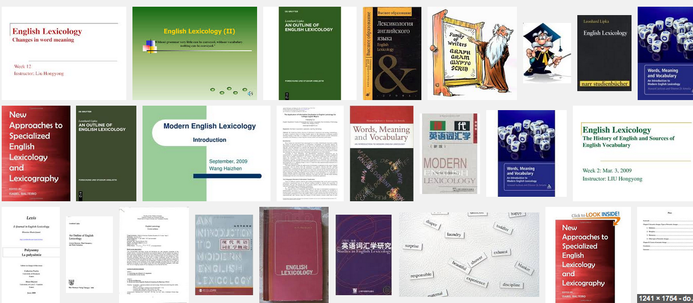
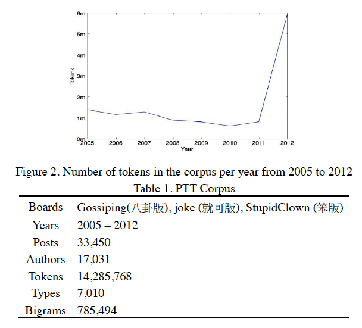

## Outline
<!-- comment -->
1. Introduction
2. Lexicology with the BIG DATA
3. Measuring Lexical Aging as an Example
4. Conclusion


--- bg:#FFFAF0

## Outline
<!--  ========================================================   -->
1. __`Introduction`__
2. Lexicology with the BIG DATA
3. Measuring Lexical Aging as an Example
4. Conclusion


---

## Lexicalization and Language Change

詞彙與詞彙化的變遷研究

> - Language in use is a dynamically developing system adapting to its ever-changing social environment.
> - Language change: phenomenon or epiphenomenon (of a static capacity, Lehmann 1993:320)?
> - Lexicalization: the process by which new items that are considered 'lexical' come into being (Brinton and Traugot, 2005)
  - __adoption into the lexicon__
  - __falling outside the productive rules of grammar__


---

## The Emergent Lexicon 

> - Lexicon is understood as *a finite list of forms and the possibilities for combining them*

> - Functionalistic take on the (Mental) Lexicon (,if any):
    - 'our understanding of both language structure and use is enhanced by the recognition that memory for language is highly affected by language use' (Bybee,1998).
    - The memory representation of language consists of units that can constitute utterances or intonation units, i.e., not just words, but also phrases and constructions. 

> - It is the __formulation__ that annoies linguists.


---

## The Emergent Lexicon 

$$
\mathbf{Change}_{a,b} = \mathbf{A} \succ \mathbf{B}
$$

$$
\mathbf{Change}_{a,b} = \mathbf{A} \succ 
 \begin{Bmatrix}
  A \\
  B 
 \end{Bmatrix}
 \succ \mathbf{(B)}
$$

`Most attention were paid to the questions "What is in the arrow?" and "How does change come about?"`

--- 

## The Emergent Lexicon v.2 : Before and After

> - Lexicalization (and grammaticalization) 談的是如何進場 
> - 網路時代的海量數據引出了語言單位的**生命力**指標量度需求（能活多久或為何退場）? BUT note [pressing `p`]

*** =pnotes
<q>老詞不死，只是逐漸凋零 Old soldiers never die, they just fade away</q>

In some cases words might be *dead* to all purposes, but could revived by the media periodically for the purpose of *irony* or *parody*.


---
  
## Questions to be answered 
  
**Big Three** (Brinton and Traugott, 2005)

1. The constraint problem: what is the set of possible changes and linguistic conditions for change?
2. The transition problem: what are the intresting stages that define the path by which A gives rise to B?
3. The actuation problem: how does change start, when and where does it start ('actuation') and how does it spread through the system ('actualization')?

  
**Missing**
  
<a class="btn btn-large btn-danger" rel="popover" data-content="How does words survive? what is the life cycle?" data-original-title="4th Q" id='example'>The survival problem</a>

<a id='example' data-content='Change directory doesn't actually change the directory. It changes the shell's idea of which directory we are in' data-original-title='Note'></a>


--- bg:#F0FFF0
  
## Neologism and Lexicalization
  
晚近的新詞研究

- Neologisms (new entries in the inventory) can be seen as the results of the *conception of lexicalization*.
- The production of neologisms encompasses a wide variety of linguistic processes, both sybchronic and diachronic.
- Mechanisms involved: *create, modify, combine,* or *separate* existing units, and thus lexicalization would seem to include opposing directions of change leading to greater or lesser **dependency** and greater or lesser **compositionality**.


--- bg:#F0FFF0
  
## Neologism Classification
  
1. [`Renouf's classification` 2013]: __lexical neology__ (i.e., newly-coined lexical items) and __semantic neology__ (i.e., new sense of word) and __grammatical neology__ (i.e., neologisms that change grammatical class). 
<!-- new connotative sense? 加倍奉還 -->

2. e.g, [Arab Spring](http://www.google.com/trends/explore#q=Arab%20spring&cmpt=q); troll (an individual who posts inflammatory, rude, and obnoxious comments to an online community); [friend](http://www.wordnik.com/words/friend).

3. *lexical neology* and *semantic neology* can be identified in a text corpus at surface level by automatic means (by comparing existing lexicon and discovering the change in collocational environments), while *grammatical neology* can be identified at a post-processing stage of  semantic neology.


<!-- http://www.vappingo.com/word-blog/great-examples-of-neologisms/
Examples of Popular Culture Neologisms

Tebowing: description of a prayerful victory stance derived from NFL quarterback Tim Tebow.
Brangelina: used to refer to supercouple Brad Pitt and Angelina Jolie.
Metrosexual: A man who dedicates a great deal of time and money to his appearance.
Muffin top: This refers to the (often unsightly) roll of fat that appears on top of trousers that feature a low waist.
Stitch 'n' bitch: A gathering of individuals who chat or gossip while knitting or crocheting.
BFF: Stands for best friends forever. Used to state how close you are to another individual.
Vagjayjay: Slang term for the vagina that was believed to have been coined by Oprah.
Chilax: To calm down or relax, it is a slang term used when someone is starting to get uptight about something that is happening.
Racne: Acne located on a woman’s chest.
Staycation: A vacation at home or in the immediate local area.

-->


--- &radio

## 複習考 QUIZ

[魯蛇] 屬於那一類新詞?

1. _lexical neology_
2. semantic neology
3. grammatical neology


*** .hint
韓語：루저남


*** .explanation
> Ptt有許多網友喜歡諷刺有成就、或日子過得不錯的人，例如：富二代、公務員等「人生勝利組」，而嘲諷者就被反酸是 loser，例如：失業、領22k、交不到女友等，之後就逐漸出現「魯蛇」的諧音用法取代 loser，在2012年年中時已有這樣的用法，在2012年12月到2013年1月間，這個詞突然開始大流行，先是在八卦版出現，之後也在各大板看板出現，成為2013年（適逢蛇年）初最流行的新用語之一(source:wiki)


--- {class: class, tpl: tabs}

## Neologism Detection in (Computational) Linguistics

*** {class: active, id: language resources}

You need **corpus and lexicon** are the prerequisite for an empirical surveys. A *reference* corpus will make the identification task simpler: An *unseen* word is matched against the corpus so that it is pinpointed at its first occurrence, and deemed to be a candidate for neologism. (cf. *hapax legomena*)

*** {id: algorithms}


Use **collocational information** to (semi-) automatically determine the candidate's usage and definition.


--- bg:#FFFAF0
<!--  ========================================================   -->
## Outline
<!-- comment -->
1. Introduction
2. __`Lexicology with the BIG DATA`__
3. Measuring Lexical Aging
4. Conclusion


--- .nobackground .quote

<q>__Lexicology__: the study of the meaning and uses of words   (Lipka, 2002) </q> 


---

## Lexicology





--- .segue bg:indigo

## BIG DATA : What's that?
<!--__Lexicology__ is the branch of linguistics which studies words. (function, meaning, relations, composition, etc) OK, -->


---

## BIG DATA

<iframe src='assets/img/bigdata.jpeg' width=800px height=250px>
</iframe> 


---

## BIG DATA
> Next time you run a Google search, think about the fact that it's just one of 2 million that Google will receive in that minute. In the same amount of time, Facebook users post 684,478 pieces of content. Crazier still, online shoppers spend an average of 272,070 every minute. That's over 391 million every day — quite the chunk of change. [cited from here](http://mashable.com/2012/06/22/data-created-every-minute/)


--- .dark .nobackground .quote

<q> BIG Data makes Big Impact ......</q>


---

## Reflections on Thirty Years of Scientific Methodology and the Next Thirty

<iframe src='assets/img/data_deluge.png' width=800px height=250px>
</iframe> 


---

## Google Books for [Culturomics](http://www.culturomics.org/)

- Google corpus of digitized texts containing about 6% (over 8
million books) of all books ever printed.

> Analysis of this corpus enables us to investigate cultural trends quantitatively. We survey the vast terrain of 'culturomics,' focusing on linguistic and cultural phenomena that were reflected in the English language between 1800 and 2000. We show how this approach can provide insights about fields as diverse as **lexicography**, the **evolution of grammar**, collective memory, the adoption of technology, the pursuit of fame, censorship, and historical epidemiology.(*Science, 331(6014): 176–82*, 2011).

- CED?? project?? 

--- &twocol

## Google Books for [Culturomics](http://www.culturomics.org/)

*** =left 
#### The evolution of grammar


*** =right
<iframe src='assets/img/gngram.png' width=800px height=250px>
</iframe> 

---

## From Sequences to Syntactically-annotated corpus (Lin et al. 2012) 

- This new edition introduces syntactic annotations: words
are tagged with their part-of-speech, and head-modifier
relationships are recorded.


--- &twocol

## From Sequences to *Dependecy-grammar* Syntactically-annotated corpus ([Goldberg and Orwand, 2013](http://googleresearch.blogspot.tw/2013/05/syntactic-ngrams-over-time.html))

- [syntactic-ngrams](http://storage.googleapis.com/books/syntactic-ngrams/index.html):  structures in which the contexts of words are based on their respective position in a syntactic parse tree, and not on their sequential order in the sentence.

*** =left 


*** =right


--- .shout #demo

# [DEMO](https://books.google.com/ngrams/): 
### 中國人愛什麼?


--- &interactive

## Data Science Analytics (makes advances like never before)


```r
require(googleVis)
#load("~/academic_activities/talks and tutorials/2013/ntnu/mot/mot.RData")
# head(convdata)
# head(compdata)
#Modal <- gvisMotionChart(convdata, idvar="VERB", timeva="DECADE") 
#print(Modal, tag ='chart')
#plot.gvis(Modal) 
```


---

## New Methodological Issues [1]: Size

Do we really need (more than) 500 billion words for linguistics?
- e.g., [COHA:THE CORPUS OF HISTORICAL AMERICAN ENGLISH](http://corpus.byu.edu/coha/) vs. [Google Book ngram] 

Are there any __hard rules__ regarding how large a corpus ought to be? 

> For the study of prosody (i.e. the rhythm, stress and intonation of speech), a corpus of 100,000 words will usually be big enough to make generalizations; for the analysis of verb-form morphology (i.e. the use of endings such as -ed, -ing and -s to express verb tenses) would require half a million words. (Kennedy (1998: 68)), while Biber (1993) suggests that a million words would be enough for grammatical studies.


Depending on you research topic!


--- &twocol 

## New Methodological Issues [2]: Unit

A two-edged Sword cuts Both Ways: 
`How BIG DATA __kill__ Chinese Corpus Linguistics (Hsieh, 2013)`

*** =left
- (with discrete views on the Units of Lexicon)
- 台北市長春藥店; 大都會
- `這不是朱學恆` 效應

*** =right

<iframe src='assets/img/freqspec.pdf' width=200px height=90px>
</iframe> 

--- &twocol 

## New Methodological Issues [2]: Unit 

A two-edged Sword cuts Both Ways: 
`How BIG DATA __kill__ Chinese Corpus Linguistics (Hsieh, 2013)`

*** =left
- Vocabulary Growth Curve (V1/Vn) already tells you something wrong.


*** =right

<iframe src='assets/img/vgc.pdf' width=200px height=90px>
</iframe> 


---

## The BIG LEXICON Project (2014-)

- **Functional take**, again: 'the smaller units familiar from structural analysis are *not* independent units, but rather emerge from the larger stored units via a network of connections among them'.

- A bold (but sincere) proposal:
  - Segmentation as annotation (of wordhood)
  - __Lexical units__  * __Multiple dimensions__ (so far: 200,000 * 87 matrix)


---
    
## The BIG LEXICON Project: Variables

| **Module.Variable**        | **Description**                       |
|---------------------|---------------------------------------|
| `concept.sense`     | word sense number from [Chinese Wordnet, CWN](http://lope.linguistics.ntu.edu.tw/cwn/), please [help](http://lope.linguistics.ntu.edu.tw/cwikin/)       |
| `concept.gloss`     | sense definitions from CWN    |
| `concept.relations` | lexical semantic relations      |
| `emotion.polarity`  | polarity of descriptive emotional words|
| `emotion.location`  | location collocates of emotion  |
| `emotion.cause`     | cause collocates               |
| `emotion.result`    | resulting event collocates        |
| `emotion.time`        | time collocates        |
| `frequency.asbc`      | frequency of Sinica Corpus|
| `frequency.plurk`     | frequency of Plurk Corpus       |
| `frequency.childes`   | frequency of CHILDES Corpus  |
| `frequency.ptt`       | frequency of PTT                    |

**AND MANY MORE!** modules in progress: 情緒 發展歷程 語義 使用頻率 年紀 關係 性別 教學難易 部首概念 意類 知識本體 社會心理人格 . . . . . . . . . . . . . .  


--- .centrepre &vcenter

**Think BIG With BIG LEXICON** 
(what you'd ever want to know about the *Lexicon*)

<a class='example'>Example</a>

    ---
    Question: 
    ---
     

--- .centrepre &vcenter

<a class='example'>Your Turn</a>

    Brainstorm: what are some of the trends/corelation 
    that you  might want to explore? What additional 
    variables would you need to create? What other 
    data sources might you want to use? Pair up and 
    brainstorm for 1 minute.
    


--- .nobackground .quote

<q> We believe the __BIG Lexicon__ should be the new infrastructure for linguistics, and invite you to join in us.</q>


--- bg:#FFFAF0

<!--  ========================================================   -->
## Outline

1. Introduction
2. Lexicology with the BIG DATA
3. __`Measuring Lexical Aging`__
4. Conclusion

---
## Not uxorious anymore?

<iframe src='assets/img/uxorious.png' width=200px height=90px>
</iframe> 

press *p* 

*** =pnotes
<iframe src='assets/img/ux.png' width=200px height=90px>
</iframe> 


---

## Modeling Neologistic Behavour [1]

Stage in Life-cycle (Renouf, 2013)
- Increase in frequency: gradual, or sudden if in vogue
- Orthographic adjustment
- Lexical productivity
- Creativity
- Settling down
- Obsolescence
- Death
- Re-birth or revival
 


---

## Modeling Lexical Aging: First try (Liu,Hsieh and Prevot, 2013)

- **Proper nouns** are ruled out, for they are mostly propelled into the media glare due to a real-world event ot popular preoccupation.
- PTT-based (2015-2012, 八卦版+就可版+笨版), preproceesed.


- Time series predictive model against human judgement.

---

## PTT Corpus




---

## Results


- These large, short-term fluctuations add an important new dimension to the study of the long-term dynamics of language, as any novel expression must survive in the short
term to survive in the long term. (Altmann, 2011)

---

## Results

<iframe src='assets/img/timeseries.pdf' width=200px height=90px>
</iframe> 


---

## Modeling Lexical Aging: Our Second Comings 

1. Use `google book ngram` as training data (to infer the laws), and `ptt` as test data.

2. Previous efforts exploit the syntagmatic patterns of a candidate neologism (e.g., via `collocate profile`).

3. we propose to incorporate paradigmatic patterns (via `social network` of the candidate).

4. Evaulate the preditions against large-scale human jugements (via questionnaire web application or APP games)


---

## Modeling Lexical Aging: Our Second Comings 

**Special considerations**

詞彙不像人，可以離群索居，成就自己的意義。詞彙的意義是透過系統間的關係相對定義出來的。
因此詞彙的社會行為。(以魯蛇為例，利用批踢踢找出共現，算出相𨶙詞彙，算出依存度)。


1. Frequency Diversity (e.g., the dissemination of words across individuals/generations/topics/)

2. Strength of Ties

3. Niche (when different forms compete to express the same meaning)

```
**Distributional Semantic Model**
```


--- bg:#FFFAF0

## Outline

1. Introduction
2. Lexicology with the BIG DATA
3. Measuring Lexical Aging
4. __`Conclusion`__

---

## Where do we go from here? 

- 大數據正在改變語言學 Big data help us understand the nature of linguistic and cultural dynamicality.
- 詞彙生命量度是個測試好例子 Measuring/modeling Lexical aging involves every aspects of lexicology.
- 大詞庫將是必備工具箱 We hope that this study could serve as an invitation to lexicologists in exploring their *lexical data* beyond micro-levels of analysis, and using big data as the 'toolkit' to map the contours of lexicology.


---

## Implications and Applications

- 模擬語言變遷的機會 Modeling lexical changes
- 重估新詞的地位 OOV reestimation in NLP
- 客觀化辭典收詞標準Measures are useful for **lexicographers, translators** and **terminologists**. 
    - [Traditional ways](http://www.merriam-webster.com/help/faq/words_in.htm) to decide which words to include in the dictionary and to determine what they mean could be improved/enhanced with computational linguistics.


```
OH, MY, "Won’t *twerking* just go away?" 
or is it *twerking* its way into the dictionary?
[press p to look into story]
```  
*** =pnotes
<!--http://artsbeat.blogs.nytimes.com/2013/08/28/oxford-english-dictionary-learns-how-to-twerk/?_r=0
-->


In the days following Miley Cyrus’s much-discussed bump-and-grind performance at Sunday’s MTV Video Music Awards, the word “twerk” — that is, to dance “in a sexually provocative manner involving thrusting hip movements and a low, squatting stance” — seems to be ubiquitous. It’s on the tip of the tongue of nearly every television host, and a search of LexisNexis archives turns up the word in more than 250 news articles in the last week alone.


---

## Acknowledgements

王伯雅, 劉純睿, Ramnathv (Slidify)

---

## Reference
- Altmann, E.G., Pierrehumbert, J.B., Motter, A.E.. Niche as a determinant of word fate in online groups. *PLoS ONE 6(5), e19009* (2011).

- Altmann, E.G. Zakary L. Whichard, Motter, A.E.. Identifying Trends in Word Frequency Dynamics. *J Stat Phys151* (2013).

- Renouf, Antoinette. A Finer Definition of Neology in English—The Life-cycle of a word. *Studies in Corpus Linguistics 57.* (2013).

- Petersen, Alexander  et. al. Statistical Laws Governing Fluctuations in Word Use from Word Birth to Word Death. *Scientific Report* 2:313. (2012).


--- #myslide

## 詞彙股票 (source: Ramnathv)

<script>
$('#myslide').on('slideenter', function(){
  $(this).find('article')
    .append('<iframe src="http://bl.ocks.org/mbostock/raw/1256572/"></iframe>')
});
$('#myslide').on('slideleave', function(){
  $(this).find('iframe').remove();
});
</script>


